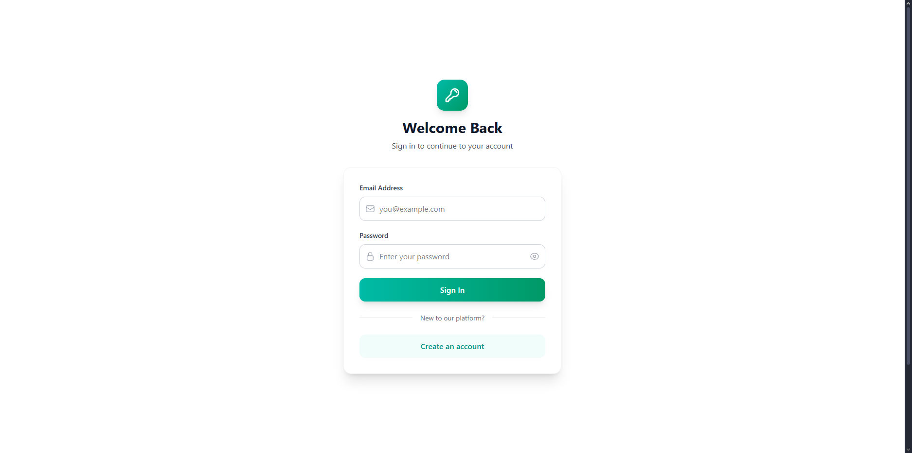
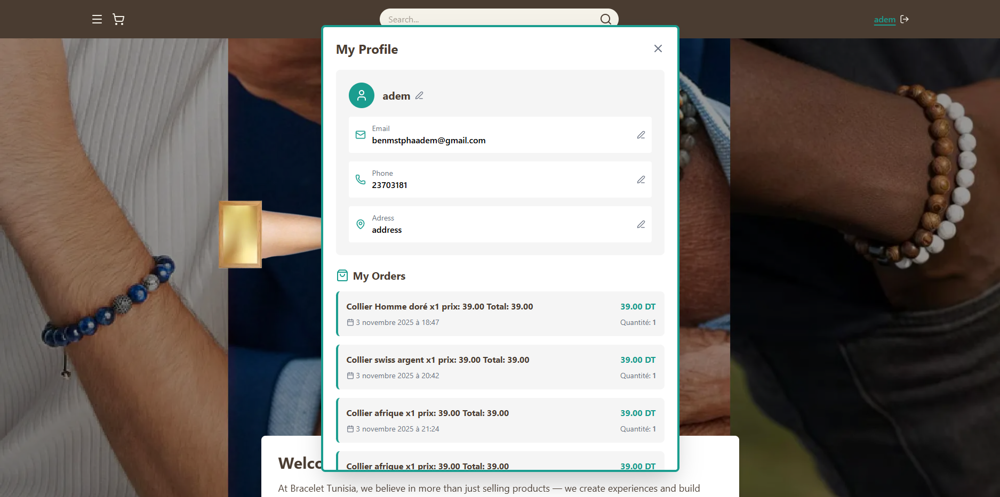
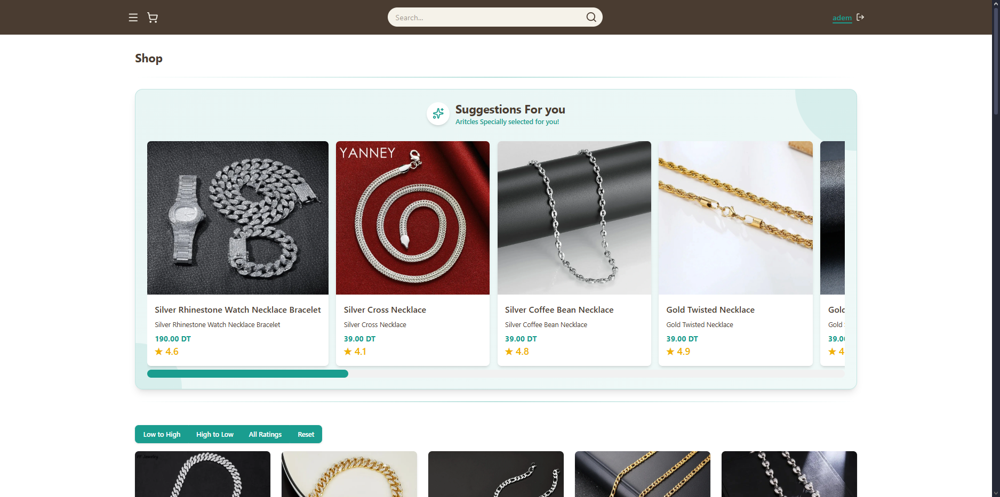
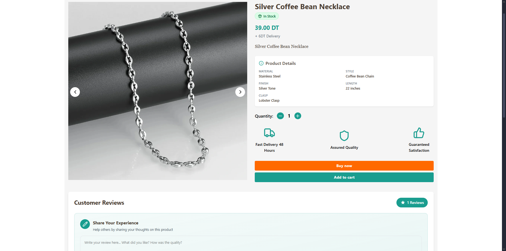
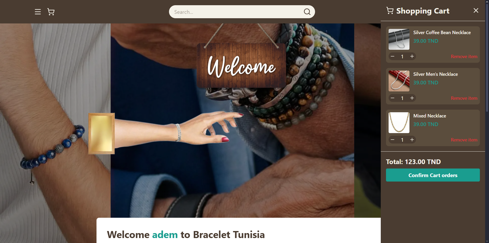
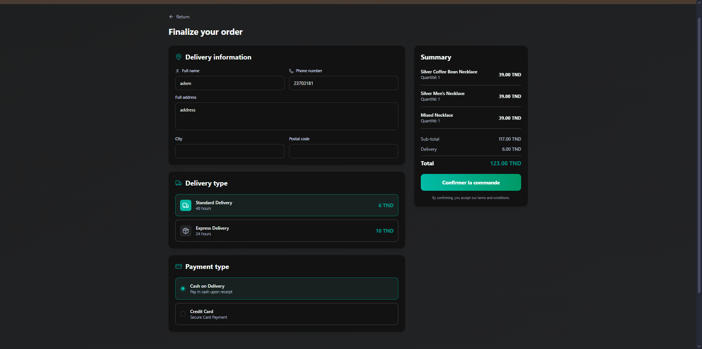

# 🛍️ E-commerce Bracelet Tunisia

A modern and elegant e-commerce platform dedicated to selling bracelets in Tunisia, built with React and Firebase.

🔗 **Live Demo**: [ecommerce-bracelet.vercel.app](https://ecommerce-bracelet.vercel.app)

## 📋 Project Description

E-commerce Bracelet Tunisia is a complete web application that allows users to browse, select, and purchase bracelets online. The project offers a seamless user experience with cart management, customizable user profile, and an integrated order system.

## 🚀 Technologies Used

### Frontend
- **React.js** - JavaScript library for user interface
- **Vite** - Modern and fast build tool
- **Tailwind CSS** - Utility-first CSS framework for styling
- **Context API** - Global state management

### Backend & Database
- **Firebase Firestore** - Real-time NoSQL database
- **Firebase Authentication** - Secure authentication system

### Other
- **UUID** - Unique identifier generation
- **localStorage** - Local storage for session persistence
- **Vercel** - Deployment platform

## 📦 Prerequisites

- **Node.js** (latest LTS version recommended)
- **npm** or **yarn**
- A modern web browser

## 🔧 Installation and Setup

### 1. Clone the repository
```bash
git clone https://github.com/mstpha/Ecommerce-Bracelet-Tunisie.git
cd Ecommerce-Bracelet-Tunisie
```

### 2. Install dependencies
```bash
npm install
```

### 3. Run the application in development mode
```bash
npm run dev
```

The application will be accessible at `http://localhost:5173`

### 4. Build for production
```bash
npm run build
```

## 📁 Project Structure

```
Ecommerce-Bracelet-Tunisie/
├── public/              # Static files
│   └── README/          # Screenshot images
├── src/
│   ├── components/      # Reusable React components
│   ├── context/         # Context API for state management
│   ├── services/        # Firebase services (userService)
│   ├── data/            # Product JSON file
│   ├── pages/           # Application pages
│   ├── App.jsx          # Main component
│   └── main.jsx         # Application entry point
├── package.json         # Dependencies and scripts
└── README.md           # Documentation
```

## ✨ Implemented Features

### 🔐 Authentication
- **Registration** - New user account creation
- **Login** - Secure authentication via Firebase
- **Session Management** - Persistence with UUID and localStorage



### 👤 User Profile
- Name modification
- Email modification
- Phone number modification
- Address modification
- Order history



### 🛒 Product Catalog
- **Product Display** - Complete list of available bracelets
- **Recommended Products** - Dedicated section for featured items
- **JSON Storage** - Organized and easily modifiable product data



### 📦 Product Detail Page
- Complete product information
- **Instant Purchase** - Direct redirect to checkout
- **Add to Cart** - Option to continue shopping



### 🛍️ Cart Management
- **Side Menu** - Cart display in sidebar
- View added items
- Real-time total calculation
- Quantity modification
- Item removal



### 💳 Checkout Process
- **Checkout Page** - Purchase completion form
- **Mock Payment** - Credit card entry form (fictitious data)
- Order confirmation
- Save to user order history



### 🎨 User Interface
- Responsive design adapted to all screens
- Intuitive navigation
- Smooth animations and transitions with Tailwind CSS
- Optimized user experience

## 🎓 Context

This project was developed as part of a university project, demonstrating full-stack web development skills with modern React and Firebase technologies.

## 👨‍💻 Author

**Mustapha** - [GitHub](https://github.com/mstpha)

## 📝 License

This project is a university project for educational purposes.

---

⭐ If you like this project, feel free to give it a star on GitHub!